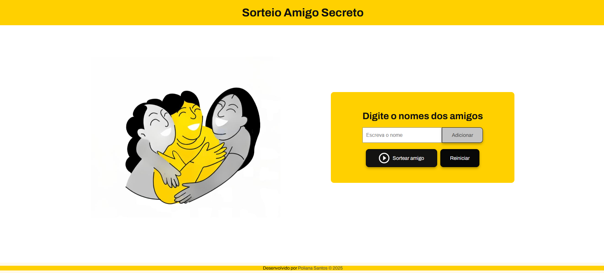
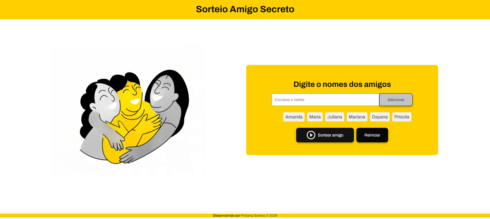
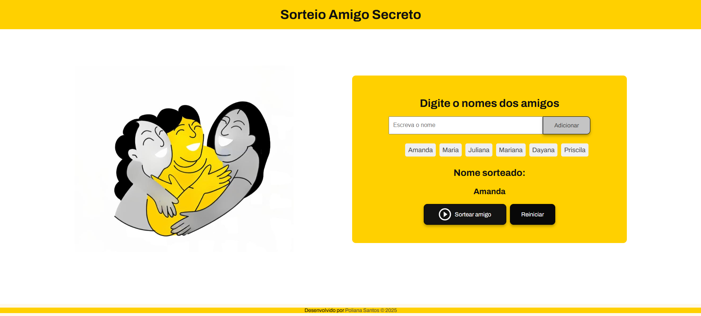

# 🎁 Projeto: Sorteio Amigo Secreto

Este é um projeto desenvolvido como parte do **desafio do programa Oracle Next Education (ONE)** em parceria com a Alura. O objetivo é criar uma aplicação web simples e intuitiva para cadastrar nomes de participantes e realizar o sorteio de um "Amigo Secreto".


---

## 🚀 Funcionalidades

- ✅ Reiniciar a lista de nomes e limpar o resultado.
- ✅Adicionar nomes a uma lista
- ✅Exibir os nomes inseridos
- ✅Sortear **um único nome aleatório**
- ✅Reiniciar o sistema

---

### ➕ Adicionar Nome
- O nome digitado no campo de entrada é adicionado à lista, desde que:
  - Não esteja vazio
  - Não tenha sido adicionado anteriormente
- A lista é atualizada automaticamente após cada inserção

### 📃 Exibir Nomes
- Todos os nomes inseridos são exibidos dinamicamente em uma lista (`<ul>`) no HTML

### 🎯 Sortear Nome
- O sorteio é feito com base na quantidade de nomes presentes na lista
- Um índice aleatório é gerado para selecionar **um único nome**
- O nome sorteado é exibido abaixo da lista
- O nome **não é removido** da lista após o sorteio

### 🔄 Reiniciar
- Ao clicar em "Reiniciar":
  - A lista de nomes é apagada
  - O resultado do sorteio é limpo

## 📸 Capturas de Tela

### 1. Tela inicial


### 2. Após adicionar nomes


### 3. Resultado do sorteio


---

## 🎯 Como usar

1. **Clone este repositório:**
   ```bash
   git clone https://github.com/seu-usuario/amigo-secreto.git
   ```

2. **Abra o arquivo `index.html` em seu navegador:**
   - Você pode clicar duas vezes no arquivo ou usar uma extensão como Live Server no VS Code.

3. **Adicione nomes no campo de entrada.**
   - Clique em **Adicionar** para registrar cada nome.

4. **Clique em "Sortear amigo"** para realizar o sorteio aleatório.

5. **Use o botão "Reiniciar"** para limpar a lista e começar novamente.

---

## 🧠 Lógica Implementada

- O array `nomes` armazena todos os nomes inseridos
- A função `adicionarNome()`:
  - Verifica se o nome é válido
  - Impede duplicatas
  - Atualiza a lista na tela
- A função `mostrarNomes()` atualiza o conteúdo visual da lista de nomes
- A função `sortearAmigo()`:
  - Verifica se há nomes na lista
  - Realiza o sorteio aleatório com base no tamanho do array
  - Exibe o nome sorteado
- A função `reiniciar()` zera o sistema, limpando a lista e o resultado

---

## 💻 Tecnologias Utilizadas

- HTML5
- CSS3
- JavaScript (puro)
- Google Fonts

---

<div id="autor" align="center">
  
  **Criado e desenvolvido por [Poliana Santos](https://www.linkedin.com/in/polianasantoss/).**
  
 <div align="center"> 
  <a href="mailto:zpolianasantos@gmail.com"></a>
   &nbsp;&nbsp;&nbsp;&nbsp;&nbsp;
  <a href="https://github.com/PollySantos" target="_blank"></a>
   &nbsp;&nbsp;&nbsp;&nbsp;&nbsp;
  <a href="https://www.linkedin.com/in/polianasantoss/" target="_blank"></a>
  </div>
</div>

<br>

<div align="center">
  &#11165;&nbsp;<a href="#inicio"><strong>Voltar ao topo</strong></a>&nbsp;&#11165;
